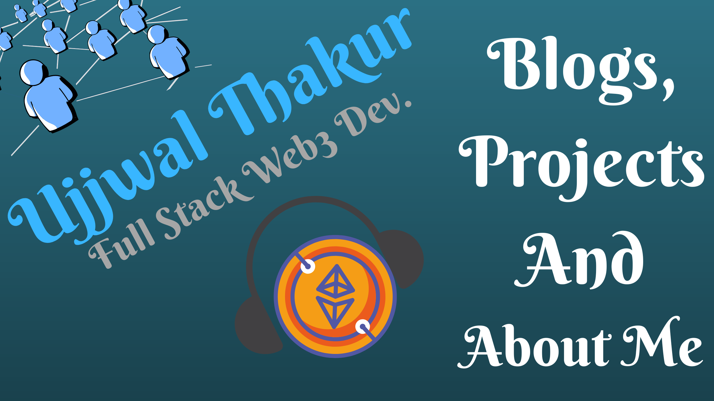

# Hello, Everyone!👋

I am an aspiring Developer Advocate with a strong passion for building subgraphs and exploring The Graph protocol's capabilities. I firmly believe that subgraphs unlock the true potential of decentralized applications and constantly push the boundaries of this technology. Beyond development, I am dedicated to teaching others about The Graph, making complex concepts accessible to all learners. When not coding or teaching, I enjoy experimenting with new web3 technologies.

### **Github Streaks Stats**

 
 

### **Language Stats**

 
  
  

#### **My Stats**

 
 

 

